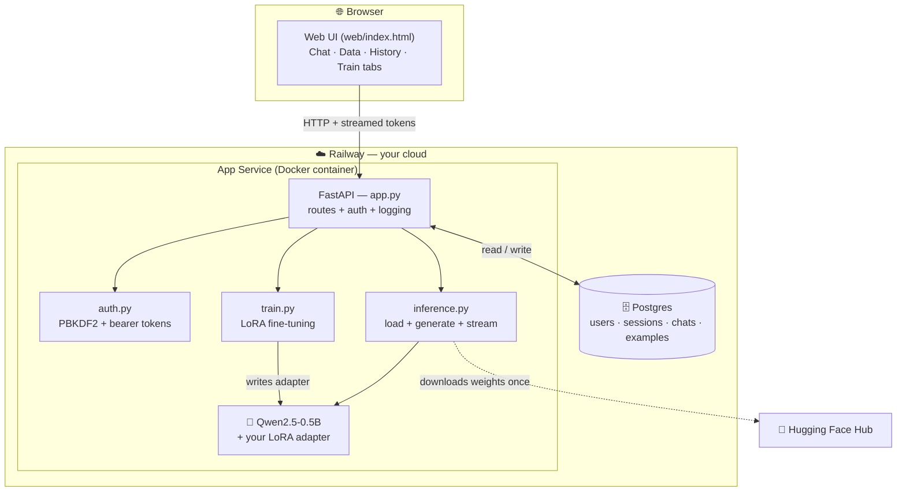
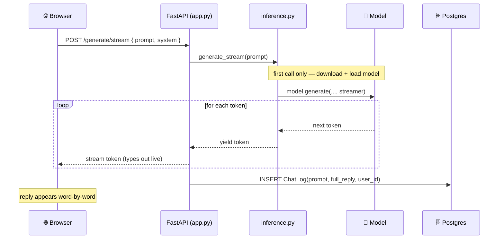
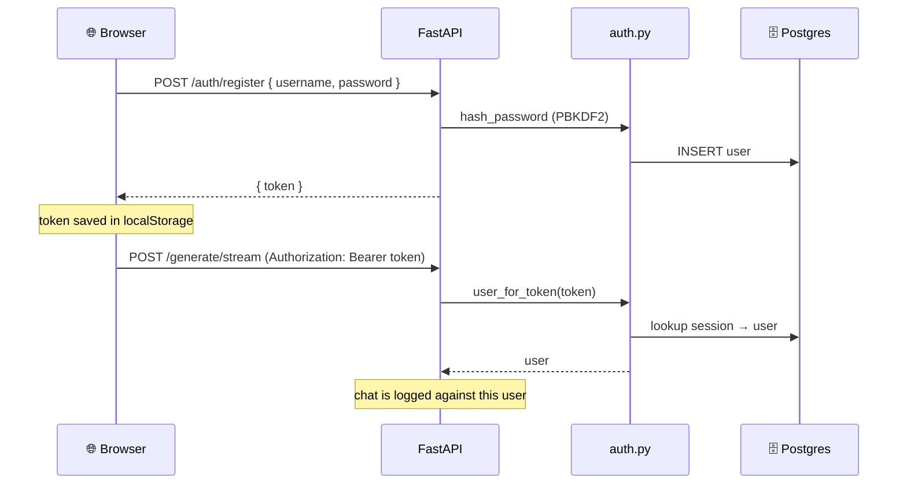
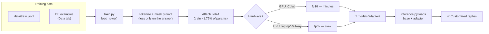
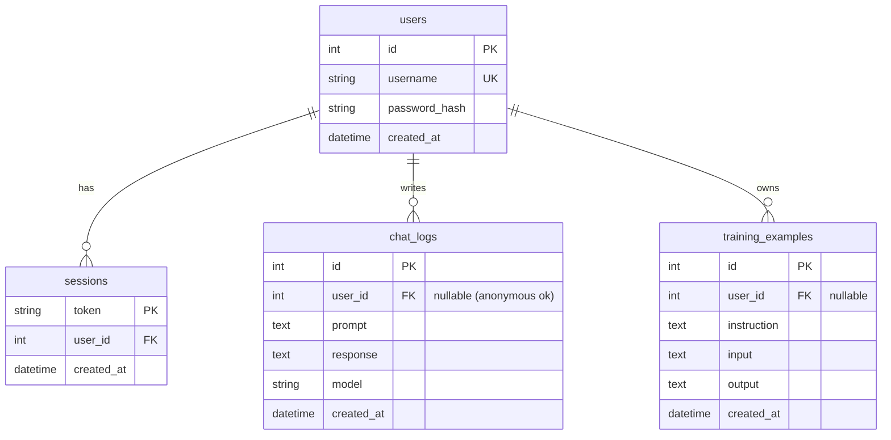
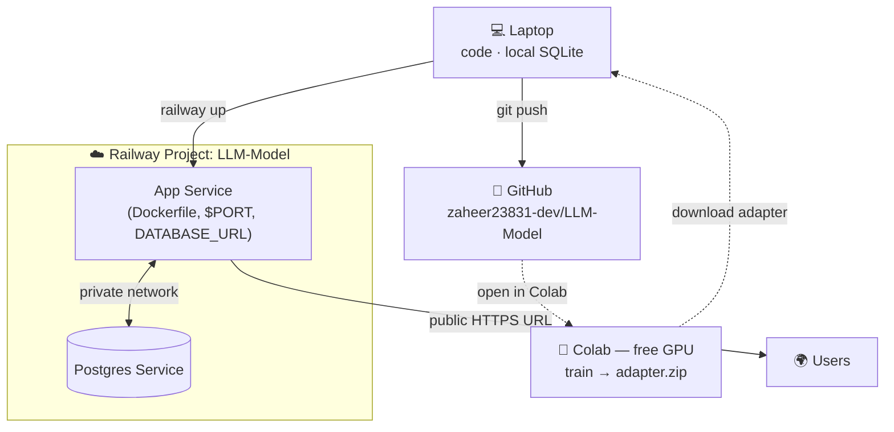
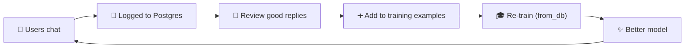

# 🏗️ Architecture — My LLM

A self-hosted, fine-tunable LLM chat application. You **download an open-source
model, fine-tune it on your own data, chat with it, and deploy it** — with user
accounts, chat history, and a managed database. Nothing is sent to a third-party
AI: the model runs on your own infrastructure.

- **Live app:** https://llm-model-production-5149.up.railway.app
- **Base model:** [Qwen2.5-0.5B-Instruct](https://huggingface.co/Qwen/Qwen2.5-0.5B-Instruct) (Apache-2.0)
- **Fine-tuning:** LoRA adapters (PEFT)
- **Serving:** FastAPI + token streaming
- **Storage:** Postgres (Railway) / SQLite (local)
- **Deploy:** Docker → Railway

---

## 1. System overview



**Key idea:** the browser talks only to *your* FastAPI app. The app runs the
model itself (CPU inference) and persists everything to your own database. The
only outbound call is a **one-time download** of the model weights from Hugging
Face when the container first boots.

---

## 2. Components

| File | Responsibility |
|------|----------------|
| [config.py](config.py) | Single source of truth: model id, paths, hyperparameters (env-overridable) |
| [download_model.py](download_model.py) | Fetches the base model into `models/base/` |
| [inference.py](inference.py) | Loads base + adapter; `generate()` and streaming `generate_stream()`; uses all CPU cores |
| [train.py](train.py) | LoRA fine-tuning — CPU/GPU aware; trains from `train.jsonl` **or** the database |
| [app.py](app.py) | FastAPI server — all HTTP endpoints, chat logging, background training |
| [auth.py](auth.py) | Password hashing (stdlib PBKDF2) + session-token auth |
| [database.py](database.py) | SQLAlchemy models + engine (Postgres on Railway, SQLite locally) |
| [web/index.html](web/index.html) | Single-page UI: Chat, Data, History, Train + login |
| [data/train.jsonl](data/train.jsonl) | Default training examples (replace with your own) |
| [Dockerfile](Dockerfile) / [railway.json](railway.json) | Deployment config |
| [train_on_colab.ipynb](train_on_colab.ipynb) | One-click free-GPU training notebook |

### Tech stack
- **Python 3.10**, **FastAPI** + **Uvicorn**
- **PyTorch** (CPU build), **Transformers**, **PEFT** (LoRA)
- **SQLAlchemy 2.0** + **Postgres / SQLite**
- **Docker** on **Railway**

---

## 3. Request flows

### 3a. Chat (streaming)



### 3b. Authentication



### 3c. Fine-tuning



> **Where to train:** GPU (Colab/Kaggle) for real runs, CPU only for tiny tests.
> The result — a ~35 MB adapter — is what gets deployed, not the whole model.

---

## 4. Data model



---

## 5. API reference

| Method | Path | Auth | Purpose |
|--------|------|------|---------|
| GET | `/` | — | Web UI |
| GET | `/health` | — | Status + which DB is in use |
| POST | `/auth/register` | — | Create account (auto-login) |
| POST | `/auth/login` | — | Get a session token |
| POST | `/auth/logout` | Bearer | Invalidate token |
| GET | `/me` | Bearer | Current user |
| POST | `/generate` | optional | Full reply (non-streaming) |
| POST | `/generate/stream` | optional | **Streamed** reply (used by UI) |
| GET | `/history` | optional | Recent chats (yours if logged in) |
| GET | `/examples` | — | List training examples |
| POST | `/examples` | optional | Add a training example |
| DELETE | `/examples/{id}` | — | Remove an example |
| POST | `/train?from_db=` | — | Start a fine-tune (background) |
| GET | `/train/status` | — | Training progress/log |

---

## 6. Deployment topology



### What lives where (and what persists)

| Item | Location | Survives redeploy? |
|------|----------|--------------------|
| App code | Docker image | ✅ (rebuilt from source) |
| Base model (~1 GB) | downloaded into container at runtime | ❌ re-downloads each boot* |
| Fine-tuned adapter (~35 MB) | baked into the Docker image | ✅ |
| Users / chats / examples | Postgres | ✅ |

\* *Add a Railway **Volume** mounted at `/app/models` to cache the base model and skip the re-download.*

---

## 7. The data flywheel

The database turns the app into a self-improving system:



---

## 8. Running it

### Local
```bash
python -m venv .venv && .venv\Scripts\activate
pip install -r requirements.txt
python download_model.py      # one-time: fetch the base model
uvicorn app:app --reload      # http://localhost:8000  (uses local SQLite)
```

### Deploy to Railway
```bash
railway up --detach           # build + deploy the app
railway add --database postgres
# set on app service: DATABASE_URL=${{Postgres.DATABASE_URL}} and PORT=8000
```

### Train on a free GPU
Open [`train_on_colab.ipynb`](train_on_colab.ipynb) in Colab → set GPU runtime →
Run all → download `adapter.zip` → drop into `models/adapter/` → `git push` →
`railway up`.

---

## 9. Design decisions

- **LoRA over full fine-tuning** — trains ~1.75% of parameters; runs on modest
  hardware and produces a tiny, portable adapter.
- **Self-hosted model over an API** — full ownership and privacy; prompts never
  leave your infrastructure. Trade-off: a small CPU model is slower/less capable
  than a giant hosted model.
- **Adapter in the image, base model at runtime** — keeps the git repo and image
  small while still shipping your fine-tune.
- **DB abstraction (Postgres/SQLite)** — zero-setup local dev, managed DB in prod,
  same code path via `DATABASE_URL`.
- **Streaming responses** — CPU generation is slow, so stream tokens to keep the
  UI responsive while the answer is produced.

---

## 10. Roadmap / ideas

- Replace sample data with a **real `train.jsonl`** for your use case
- **GGUF quantization** (llama.cpp) for ~4–8× faster CPU inference
- **Railway Volume** to persist the base model
- Per-user conversation threads; RAG for knowledge-heavy use cases
